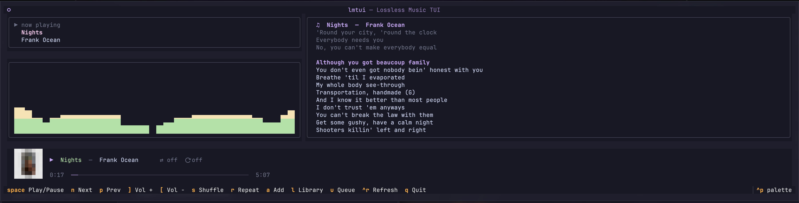

# lmtui

A lossless Apple Music TUI for macOS. Controls the native Music.app over
AppleScript so playback stays lossless. Built with Python + Textual.



## Features

- **Now Playing** panel with track, artist, album, and live progress
- **Album art** rendered as Unicode half-blocks (see [why](#why-half-block-art))
- **Playback controls** — play/pause, next/previous, volume, shuffle
- **Library browser** — playlists on the left, tracks on the right
- **Search** within a playlist by name, artist, or album
- **Add to playlist** — with duplicate detection and a modal picker
- **Remove from playlist** — two-press confirmation to avoid accidents
- **Catppuccin Mocha** theme throughout, matching the rest of the setup

## Keyboard

### Main screen

| Key | Action |
|---|---|
| `space` | Play / pause |
| `n` | Next track |
| `p` | Previous track |
| `]` / `[` | Volume up / down |
| `s` | Toggle shuffle |
| `a` | Add current track to a playlist |
| `l` | Open library browser |
| `r` | Refresh now-playing |
| `q` | Quit |

### Library browser

| Key | Action |
|---|---|
| arrows | Move selection |
| `enter` | Play selected track / load selected playlist |
| `tab` | Move focus between playlist list and tracks table |
| `/` | Search the current playlist |
| `esc` (in search) | Clear filter, return focus to table |
| `d` `d` | Remove selected track from playlist (two-press) |
| `esc` / `q` | Close browser |

## Requirements

- macOS 13 or later (tested on macOS 27 "Golden Gate")
- Python 3.11 or later
- Music.app signed in to Apple Music for lossless playback
- A terminal that supports truecolor and Unicode half-blocks
  (Ghostty, WezTerm, Kitty, iTerm2, Alacritty — see [notes](#why-half-block-art))

## Install

```bash
git clone git@github.com:Sl33pyJ/lmtui.git
cd lmtui
python3.12 -m venv .venv
source .venv/bin/activate
pip install -e .
lmtui
